# 👋 Hello, I'm **K.Pugazhmani**

  

  

  <!-- Profile Views Counter -->
  

  

  
 

&nbsp;  
&nbsp;

## 👨🏻‍💻 About Me

- 🛡️ **Ethical Hacker & Cybersecurity Specialist**  
- 💻 **Full Stack Developer & Technology Creator**  
- 🔍 **Bug Hunter & Security Researcher**  
- 🎓 **B.E. Cybersecurity Student (2023–2027)**  
- 🌟 **Innovative Technology Professional**

  
  <!-- GitHub Stats Cards -->
  
  

  

## 📊 **Professional Statistics**

  
  <!-- Achievement Badges -->
  
  
  
  
  

### 📈 **Project Statistics Pie Charts**

#### 🎯 **Project Distribution**

```mermaid
pie title 📊 Project Distribution by Category
    "🛡️ Security Tools (103)"      : 103
    "🌐 Websites (86)"             : 86
    "📱 Mobile Apps (39)"          : 39
    "🧪 Research Projects (80)"    : 80
```

#### 🛠️ **Technology Stack Usage**

```mermaid
pie title 🧰 Technology Stack Distribution
    "🐍 Python (35%)"            : 35
    "🟨 JavaScript (25%)"        : 25
    "🛡️ Security Tools (20%)"    : 20
    "📱 Mobile Dev (12%)"        : 12
    "⚙️ Others (8%)"             : 8
```

#### 🎖️ **Achievement Breakdown**

```mermaid
pie title 🏆 Professional Achievements
    "🐞 Bug Fixes (500+)"         : 650
    "🏅 Awards (200)"             : 200
    "📜 Patents (150)"            : 150
    "🧠 Research Papers (155)"     : 320 
```

## 🛠️ **Technology Arsenal**

### 🔐 **Cybersecurity & Ethical Hacking**

### 💻 **Development Technologies**

### � **Mobile Development**

### �🚀 **Future Technologies**

## 🏆 **Featured Projects**

  
  <!-- Project Cards with animations -->
  <table>
    <tr>
      <td width="50%">
        <h3 align="center">🐺 Wolf-Deduction App</h3>
        

          
          
            
          
<strong>🚀 Features:</strong>

          
✅ Real-time Deductions 
          ✅ 100% Accurate Results 
          ✅ Modern UI Design 
          ✅ Enhanced Security

        

      </td>
      <td width="50%">
        <h3 align="center">💬 SecureChat Messenger</h3>
        

          
          
            
          
<strong>🔠Features:</strong>

          
🔒 End-to-End Encryption 
          📠Voice Calls 
          🌠Auto Translation 
          🔠Biometric Auth

        

      </td>
    </tr>
    <tr>
      <td width="50%">
        <h3 align="center">🔍 CyberWolf Scanner</h3>
        

          
          
            
          
<strong>🛡️ Features:</strong>

          
🯠Threat Detection 
          ⚡ Auto Response 
          📊 Analytics Dashboard 
          🔧 Custom Exploits

        

      </td>
      <td width="50%">
        <h3 align="center">🤖 AI Security Suite</h3>
        

          
          
            
          
<strong>🧠 Features:</strong>

          
🤖 AI-Powered Analysis 
          🔮 Predictive Security 
          📈 Pattern Recognition 
          🛡️ Automated Defense

        

      </td>
    </tr>
  </table>

## 📊 **Advanced Analytics Dashboard**

### 🎯 **Skill Proficiency Chart**

### 📈 **Project Success Metrics**

| Category | Projects | Success Rate | User Rating | Downloads |
|----------|----------|--------------|-------------|-----------|
| 📱 Mobile Apps | 39+ | 96% | 4.8/5 ⭐ | 19K+ |
| 🌐 Websites | 86+ | 99% | 4.9/5 ⭐ | 7K+ Users |
| 🔒 Security Tools | 103+ | 92% | 4.7/5 ⭐ | 500+ Issues Fixed |
| 🚀 Future Tech | 20+ | 85% | 4.6/5 ⭐ | 10+ Patents |

  

  
 

## 🎨 **GitHub Activity Graph**

  <!-- GitHub Snake Animation -->
  <picture>
    <source media="(prefers-color-scheme: dark)" srcset="https://raw.githubusercontent.com/Tamilselvan-S-Cyber-Security/Tamilselvan-S-Cyber-Security/output/github-snake-dark.svg" />
    <source media="(prefers-color-scheme: light)" srcset="https://raw.githubusercontent.com/Tamilselvan-S-Cyber-SecurityTamilselvan-S-Cyber-Security/output/github-snake.svg" />
    
  </picture>

  <!-- GitHub Activity Graph -->
  

  <!-- GitHub Streak Stats -->
  

## 🏅 **Achievements & Certifications**

  <!-- Trophy Display -->
  

  ### 🎖️ **Professional Certifications**

  
  
  
  

## 🌟 **Specialized Expertise**

<b>🔠Advanced Cybersecurity</b>

- **Zero-Day Exploitation** - Custom exploit development and advanced attack vectors
- **Advanced Persistent Threats (APT)** - Sophisticated threat analysis and mitigation
- **Reverse Engineering** - Binary analysis and malware dissection
- **Custom Tool Development** - Proprietary security testing frameworks
- **Threat Intelligence** - Real-time threat monitoring and analysis

<b>🤖 AI-Powered Security</b>

- **Intelligent Threat Detection** - ML-based anomaly detection systems
- **Automated Vulnerability Scanning** - AI-driven security assessment tools
- **Predictive Security Analytics** - Behavioral analysis and pattern recognition
- **Adaptive Defense Mechanisms** - Self-learning security systems
- **Natural Language Processing** - Security report automation

<b>🌠Future Technologies</b>

- **Virtual Reality Security** - VR-based security training and testing environments
- **Blockchain Security** - Smart contract auditing and DeFi security
- **IoT Security** - Connected device vulnerability assessment
- **Quantum Cryptography** - Post-quantum security implementations
- **Edge Computing Security** - Distributed system security architecture

## 📱 **Mobile & Web Development Portfolio**

### 📊 **Development Statistics**

### 🏆 **Notable Achievements**

| Achievement | Count | Impact |
|-------------|-------|--------|
| 🏆 Awards Won | 20+ | Industry Recognition |
| 📜 Patents Filed | 10+ | Innovation Leadership |
| 🐛 Bugs Fixed | 500+ | Security Enhancement |
| 👥 Users Served | 26K+ | Community Impact |
| 🔬 Research Papers | 15+ | Academic Contribution |

## 🔥 **Current Focus Areas**

### 🎯 **2024 Goals & Progress**

### 🚀 **Innovation Pipeline**

## 🌐 **Connect & Collaborate**

### 📬 **Get In Touch**

### 🌍 **Location**

### 💼 **Open for Opportunities**

## 📈 **Real-time Metrics**

  <!-- Visitor Counter -->
  

  <!-- GitHub Followers -->
  

  <!-- GitHub Stars -->
  

    

  <!-- Touch to Navigate Link -->
  

---

### 🎨 **Pugazhmani Footer**

### 💡 **"Security is not a product, but a process. Innovation is not a destination, but a journey."**

<dev align="center">

</dev>

